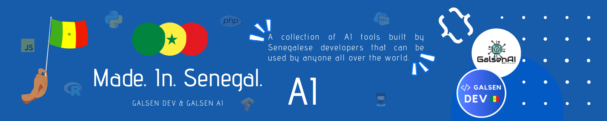

# Made in Senegal AI

👨🏽‍💻 This is a collection of AI tools built by Senegalese developers that can be used by anyone all over the world 🌍 this project is based on [Made In Senegal](https://github.com/GalsenDev221/made.in.senegal)

---

🚧 If you want to contribute on this project, please read [CONTRIBUTING guide](assets/CONTRIBUTING.md) first !

<a href="#A">A</a> | <a href="#B">B</a> | <a href="#C">C</a> | <a href="#D">D</a> | <a href="#E">E</a> | <a href="#F">F</a> | <a href="#G">G</a> | <a href="#H">H</a> | <a href="#I">I</a> | <a href="#J">J</a> | <a href="#K">K</a> | <a href="#L">L</a> | <a href="#M">M</a> | <a href="#N">N</a> | <a href="#O">O</a> | <a href="#P">P</a> | <a href="#Q">Q</a> | <a href="#R">R</a> | <a href="#S">S</a> | <a href="#T">T</a> | <a href="#U">U</a> | <a href="#V">V</a> | <a href="#W">W</a> | <a href="#X">X</a> | <a href="#Y">Y</a> | <a href="#Z">Z</a>

## A

## B

## C

## D

- **[Drowsiness Detector](https://github.com/TiDev00/DrowsinessDetection)** - A simple tool which detects drowsy driving and send a loud sound signal. by **[@TiDev00](https://github.com/TiDev00)**

## E

## F

- **[Facebound](https://github.com/diop/facebound)** - Face Detection Web App. by **[@diop](https://github.com/diop)**

## G

- **[Graph Tool Quickstart](https://github.com/eliaswalyba/graph-tool-quickstart)** - Graph tool is a very powerful tool for working with Graphs in C++ or Python. by **[@eliaswalyba](https://github.com/eliaswalyba)**

## H

## I

- **[Indigo](https://github.com/diop/indigo)** - An image transformation utility written in Go. by **[@diop](https://github.com/diop)**

## J

## K

## L

## M

## N

- **[NumMenu Bot](https://github.com/DerXter/NumMenu-Bot)** - An example of a chatbot with a number-based menu that can be used as a starting point for a project.  by **[@DerXter](https://github.com/DerXter)**

## O

## P

- **[Panorama Generator](https://github.com/TiDev00/Panorama)** - A Python tool in order to generate a panorama from images using Harris Corner Detector and RANSAC. by **[@TiDev00](https://github.com/TiDev00)**
- **[Population Analyze](https://github.com/Dar-rius/PopulationAnalyze)** - Analyze the human population from a Kaggle dataset. by **[@Dar-rius](https://github.com/Dar-rius)**
- **[Predict](https://github.com/diop/predict)** - Machine Learning Prediction by SMS. by **[@diop](https://github.com/diop)**

## Q

## R

## S

- **[SGML Parser & Converter](https://github.com/TiDev00/Sgml_Parser)** - A Python tool in order to parse SGML files mainly from WMT and convert the result into txt files for Neural Machine Translation systems. by **[@TiDev00](https://github.com/TiDev00)**

## T

## U

## V

- **[VIT (Vision Transformer)](https://github.com/lodjim/VIT)** - This is a simple implementation of VIT. by **[@lodjim](https://github.com/lodjim)**

## W

- **[Waxtane](https://github.com/MedouneSGB/Waxtane)** - The Wolof the simple way ?! Waxtane is a collection of discussion phrases in Wolof, French and English. by **[@MedouneSGB](https://github.com/MedouneSGB)**
- **[WestAfrica Economic Data](https://github.com/Ousmaneleye/WestAfrica_economic_data)** - Visualisation of West Africa's economics data. by **[@Ousmaneleye](https://github.com/Ousmaneleye)**
- **[Wolof IA](https://github.com/Dar-rius/Wolof_IA)** - A web application to train machine learning models to understand messages in Wolof in order to categorize them thanks to the labeling messages entered by visitors in the application. by **[Dar-rius](https://github.com/Dar-rius)**

## X

## Y

## Z
